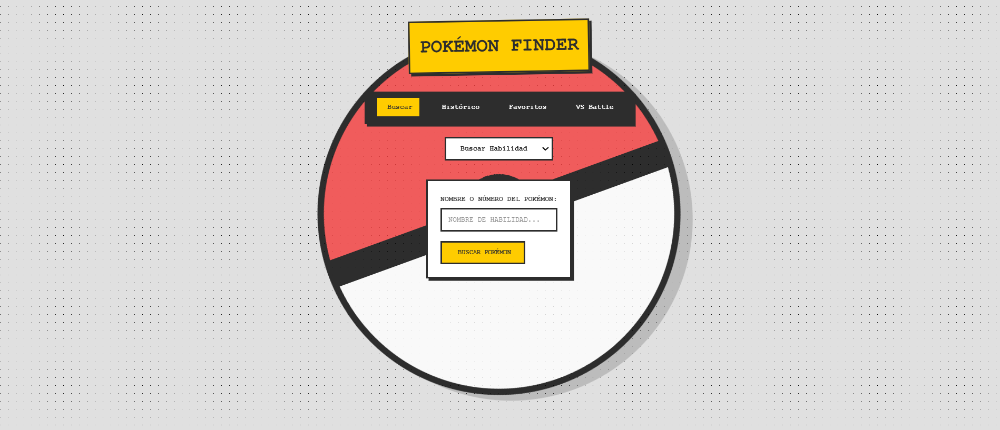
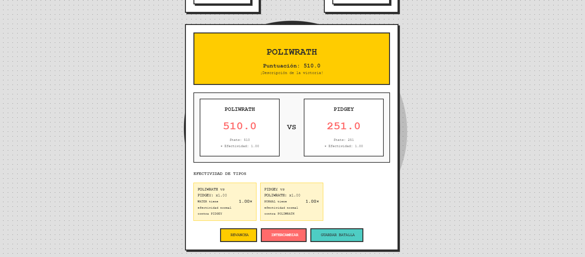
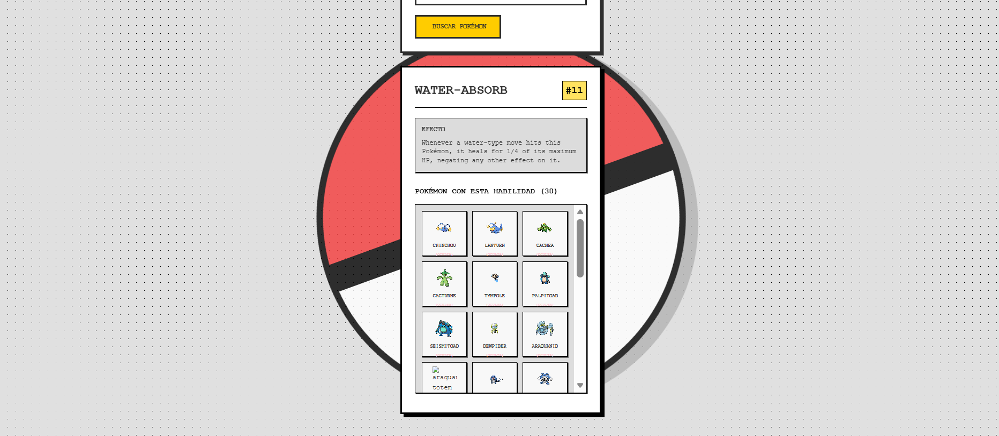

# 🎮 PokéFinder

## 🏫 Presentación del Proyecto

**UNIVERSIDAD TECNOLÓGICA DE PANAMÁ**  
**FACULTAD DE INGENIERÍA DE SISTEMAS COMPUTACIONALES**  
**DEPARTAMENTO DE PROGRAMACIÓN DE COMPUTADORAS**  
**LICENCIATURA EN DESARROLLO Y GESTION DE SOFTWARE**

**Desarrollo de Software V — Proyecto Final**

**Estudiantes:**  
- Miguel Caballero @Caballero-Miguel
- Jorge Mendoza @Ge0rgeML 
- Gloria Moreno @gloria-utp

**Facilitador:**  
Erick Agrazal @erickAgrazal

**Año:** 2025

---

# 🎮 PokéFinder

Aplicación web brutalista para buscar, explorar y comparar Pokémon consumiendo PokeAPI mediante JavaScript vanilla.

---

## 📌 Descripción Corta (para GitHub)

Aplicación web llamada **PokéFinder** que permite buscar, explorar, comparar y guardar Pokémon favoritos usando PokeAPI, JavaScript vanilla, localStorage y diseño Brutalist. Proyecto final de Desarrollo de Software V.

---

## 📝 Descripción General

**PokéFinder** es una aplicación web desarrollada sin frameworks, enfocada en el consumo de APIs REST usando `fetch()` y manejo de estados en `localStorage`.

Permite:

- Buscar Pokémon  
- Ver información completa  
- Visualizar cadenas evolutivas  
- Guardar favoritos  
- Revisar histórico  
- Comparar dos Pokémon en un modo **VS Battle**

El diseño sigue el estilo **Brutalist**:  
bordes gruesos, sombras duras, tipografía monoespaciada y colores vibrantes.

---

## 🎯 Objetivos del Proyecto

Habilidades desarrolladas:

- Consumo de APIs REST (`fetch + async/await`)
- Manipulación dinámica del DOM
- Sistema de caché con TTL usando `localStorage`
- Delegación de eventos
- Patrones de módulos (IIFE y ES Modules)
- Interfaz responsive (Mobile First + Desktop)
- Diseño con CSS puro (Flexbox, Grid, Variables CSS)

---

## 🔧 Funcionalidades Principales
- Búsqueda por nombre o ID  
- Tarjeta del Pokémon (imagen, stats, tipos, habilidades)  
- Indicador: **API / Caché / Caché Expirado**  
- Caché de 24 horas  
- Histórico CRUD  
- Favoritos CRUD  
- Visualización de cadena evolutiva  
- Navegación entre evoluciones  
- Búsqueda por habilidad (Ability API)  
- **VS Battle**: comparación de stats y tipos  
- Determinación del ganador usando multiplicadores  

---

## 🎨 Diseño Brutalist

- Bordes gruesos de 4px  
- Sombras duras sin blur  
- Tipografía monospace  
- Colores vibrantes  
- Efectos de presión en componentes  

---

## 📂 Estructura del Proyecto

📁 pokefinder/
- ├── index.html // Búsqueda
- ├── historico.html // Histórico
- ├── favoritos.html // Favoritos
- ├── vs.html // Comparador VS
- ├── shared.css // Estilos globales
- └── shared.js // Módulo de almacenamiento/cache

---

## 🌐 API Utilizada

**PokeAPI** — https://pokeapi.co/

Endpoints principales:

- `/pokemon/{name or id}`
- `/pokemon-species/{name or id}`
- `/evolution-chain/{id}`
- `/ability/{name or id}`

---

## 🚀 Instrucciones de Uso

1. Abrir `index.html` en un navegador moderno.  
2. Buscar Pokémon por nombre o ID.  
3. Explorar información, cadena evolutiva y favoritos.  
4. Revisar histórico desde el menú.  
5. Probar el modo **VS Battle** en `vs.html`.  

---

## 🖼️ Capturas de Pantalla

### 🔍 Pantalla principal

### 📄 Detalle del Pokémon

### ⚔️ VS Battle

### ⭐ Favoritos

### 🔍 Pantalla habilidad

### 📄 Historial de busqueda

---

## 🔗 Demo (GitHub Pages)

**Demo en vivo:**  
👉 https://gloria-utp.github.io/pokefinder/

---

**Link del Proyecto:**  
👉 https://github.com/gloria-utp/pokefinder

---

## 🧑‍💻 Tecnologías Utilizadas

- HTML5  
- CSS3 (Variables, Flexbox, Grid)  
- JavaScript (ES Modules / IIFE)  
- LocalStorage  
- Fetch API  

---

## 📚 Créditos

Proyecto elaborado para el curso **Desarrollo de Software V**,  
Universidad Tecnológica de Panamá.

---

